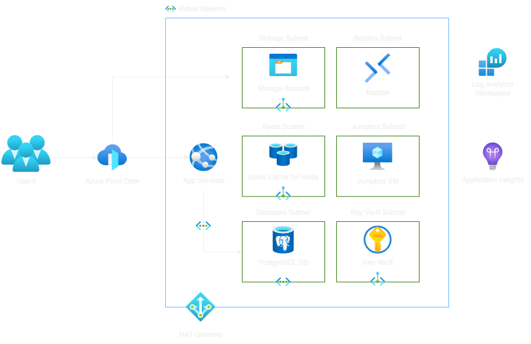

# afd-appservices-postgres-redis-sample

A sample Bicep template to deploy Azure Front Door, App Services, and Postgres
on Azure.

## Architecture Diagram

## Connecting Domain to Sample

To properly see the website in action, you need to configure your domain's
nameservers to point to Azure DNS's nameservers. You can find the nameservers in
the Azure Portal under the DNS Zone resource for the domain name you specified
in your environment configuration. Use these to configure the domain's
nameservers in your domain registrar's DNS settings.

## Additional Notes

### Connect to Postgres with Managed Identity

Reference:
[Connect with managed identity to Azure Database for PostgreSQL - Flexible Server](https://learn.microsoft.com/en-us/azure/postgresql/flexible-server/how-to-connect-with-managed-identity)
