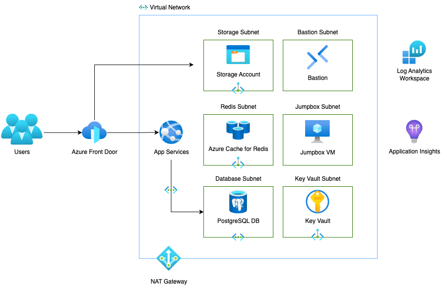

# afd-appservices-postgres-redis-sample

A sample Bicep template to deploy Azure Front Door, App Services, Postgres, and
Redis on Azure. The deployment utilizes private networking, private endpoints,
and App Service access restrictions behind Azure Front Door. Additionally,
user-managed identities are used for secure access to the Postgres and Redis.

## Architecture Diagram



## Executing the Deployment

It is highly recommended to run this repo within the Dev Container that's
provided. This is done most easily by opening the repository folder in
[Visual Studio Code](https://code.visualstudio.com/docs/devcontainers/containers)
or by
[forking the repository](https://docs.github.com/en/pull-requests/collaborating-with-pull-requests/working-with-forks/fork-a-repo)
and using [GitHub Codespaces](https://github.com/features/codespaces).

### Environment Configuration

To get started, make a copy of the `.envsample` file to `.env`. Update the
`.env` file with the values for your sample deployment. Some notes on the values
to configure:

#### Azure Config

| Variable                | Description                                                                                       |
| ----------------------- | ------------------------------------------------------------------------------------------------- |
| AZURE_LOCATION          | The Azure region that resources will be deployed to - see command below                           |
| AZURE_APPENV            | Short (_< 8 characters_), unique string to identify the deployed resources                        |
| AZURE_SUBSCRIPTIONID    | The GUID of the Azure subscription resources will be deployed into                                |
| AZURE_RESOURCE_USERNAME | Short username that will be used as a default login to deployed resources (e.g., Virtual Machine) |
| AZURE_RESOURCE_PASSWORD | Password to login to deployed resources for the `AZURE_RESOURCE_USERNAME`                         |

To get available Azure Locations, run the following `az` command (note, not all
services may be available in all regions):

```sh
# If you're not logged in, run this first:
az login

# Then this:
az account list-locations --query "[?metadata.regionType=='Physical' && metadata.regionCategory=='Recommended'].{RegionName:displayName}" --output table
```

#### Current User Config

| Variable          | Description                                                                               |
| ----------------- | ----------------------------------------------------------------------------------------- |
| PUBLIC_IP_ADDRESS | Your [public IP address](http://ifconfig.me/ip) that will be used for access restrictions |

#### Website Config

| Variable                  | Description                                                |
| ------------------------- | ---------------------------------------------------------- |
| ROOT_DOMAIN               | The root domain name for the website (e.g., `example.com`) |
| CERTIFICATE_BASE64_STRING | A Base 64 encoded PFX certificate to be used for HTTPS     |
| CERTIFICATE_PASSWORD      | The password of the PFX certificate                        |

To Base 64 encode a certificate, you can use the following command:

```sh
# For Linux:
base64 -w 0 FILE_NAME

# For macOS:
base64 -i FILE_NAME
```

#### Conditional Deployments (for debugging)

It's recommended to leave the following as `true` for the initial deployment. If
a redeployment is needed, these can be modified to reduce deployment times.
**Please** review the Bicep templates to understand what is actually going on
before setting to `false`.

| Variable           | Description                                    |
| ------------------ | ---------------------------------------------- |
| UPLOAD_CERTIFICATE | Should the PFX certificate be uploaded         |
| DEPLOY_MANAGEMENT  | Should the Management Bicep module be deployed |
| DEPLOY_SECURITY    | Should the Security Bicep module be deployed   |
| DEPLOY_NETWORKING  | Should the Networking Bicep module be deployed |
| DEPLOY_DATA        | Should the Data Bicep module be deployed       |
| DEPLOY_COMPUTE     | Should the Compute Bicep module be deployed    |

### Run the Deployment Script

Once you've configured your `.env` file, you can now execute the deployment.
This is as simple as running this command within the terminal:

```sh
./deploy.sh
```

Output will be displayed in the terminal, as well as captured to the `logs`
folder. The initial run will take some time as it will deploy all resources
(approximately 15 - 30 minutes).

If there are any errors during the deployment, the output from ARM may not
always be clear. Go to the newly created resource group (which will be in the
format of `rg-<AZURE_APPENV>`) and look at the resources that were created. You
can also review the
[deployments blade](https://learn.microsoft.com/en-us/azure/azure-resource-manager/templates/deployment-history?tabs=azure-portal)
that will show the status of the deployment (which is broken down into
subdeployments to help with debugging). Note that each deployment will be
timestamped to help track down any potential issues.

### Connecting Domain to Sample

Once a deployment is successful, one last step needs to be done to access the
deployed site: pointing a custom domain to the Azure Front Door. This is done by
going to your registrar's DNS management tool and updating the nameservers to
Azure DNS. This can be found in your newly created DNS Zone in the Azure Portal.
For more information, visit
[this doc](https://learn.microsoft.com/en-us/azure/dns/dns-delegate-domain-azure-dns#retrieve-name-servers)

### Visiting the Sample Site

Once the domain is configured, you can visit the main site by going to
`https://www.YOURDOMAIN.tld`

## Removing the Sample

Automation coming soon. For now, you can delete the resource group that was
created, which should remove all resources.

## Additional Notes

The deployed application's repository can be found on
[GitHub](https://github.com/brandonmartinez/node-redis-postgres-azure-app).
There are additional instructions on how to utilize the Virtual Machine jumpbox
that gets deployed to access your secured resources from your local machine by
double-tunneling through the jumpbox.
